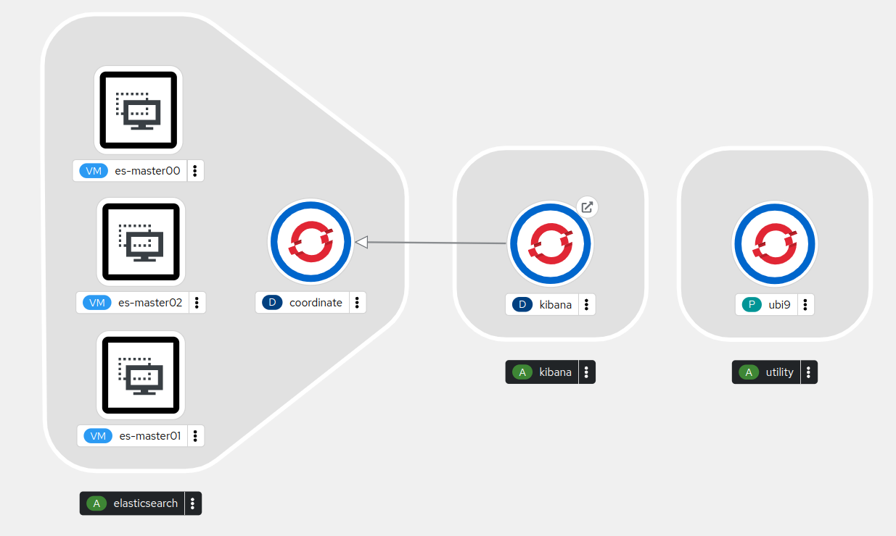

Openshift Virtualization Demo running Elasticsearch on mixed nodes (vm and containers)



### Dependencies:
* OpenShift Baremetal cluster with ODF (default storage class set and profile applied)
* OpenShift Virtualization Operator
* Cert Util Operator
* RHEL Subscription information for 
  * Subscription Org
  * Subscription Key

### Setup
```sh
sudo dnf install -y git
git clone https://github.com/purefield/opc-virt.git ~/demo
cd ~/demo/
./setup.sh
```

### Demo
Log into OpenShift Cluster

Run the demo script to create a fresh elasticsearch cluster in a new namespace (first argument or prompt, defaults to last namespace used or ```next-gen-virt```)
```sh
cd elasticsearch/
./generate-yaml.sh next-gen-virt
oc apply -f next-gen-virt.yaml
```
#### Areas to demo
* Operators -> OperatorHub
  * OpenShift Virtualization Operator (installed)
  * Migration Toolkit for Virtualization Operator (available)
* Virtualization
  * Overview
  * Templates
  * DataStore (RWX)
  * Catalog
  * VirtualMachines
    * Create
      * With Wizard
        * Create
          * Select Red Hat Enterprise Linux 9.0 VM
          * Next
            * Create virtual machine
    * [... menu] Migrate Node to Node
    * [New VM] Overview
      * Virtual Machine options
      * Metrics
      * Snapshots
* Run demo steps 
  * pick random/suggested name for namespace to pass as first argument or when prompted
  * execute generate and apply steps in shared terminal window showing VirtualMachines screen in the background
* Open Developer Perspective to show topology for the selected namespace
* In the Administrator Perspective show 
  * Networking
    * Routes
      * Select es-master00 Cockpit route
        * Log-in using elasticsearch:redhat 
          * View services and search for elasticsearch (will appear when ready)
      * Select elasticsearch route
        * Verify ```cluster_uuid``` is populated
        * Append ```/_cat/nodes``` to elasticsearch url and verify ```coordinate``` is a member
      * Open kibana route to show connected web application
* Virtualization
  * VirtualMachines
    * es-master00
      * Environment
        * Configuration Maps mounted inside the VM
          * 00yaml - Elasticsearch Node specific configuration
          * 0000sh - Multiple scripts used during VM installation
        * Secret mounted inside the VM
          * 00cert - Let's Encrypt SSL Certificate private key and chain used by the VMs
    * Migrate VM
    * Take a Snapshot of the VM

 
